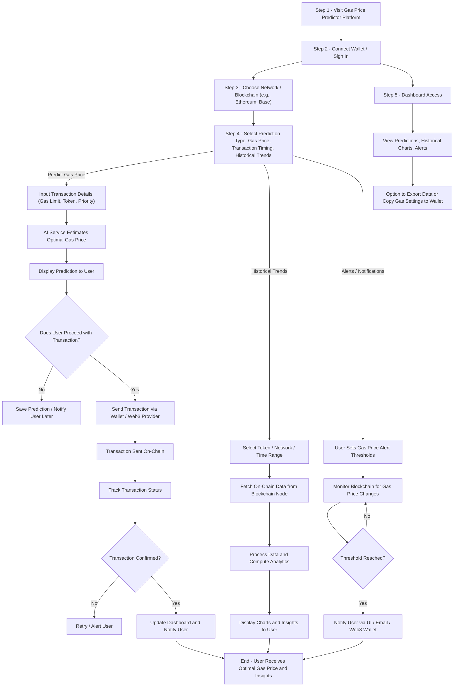

# Gas Price Predictor AI — Smart Transaction Timing Assistant

> ⚡ Predict optimal transaction times and gas fees using AI and real-time blockchain data.
 
**Gas Price Predictor AI** helps users schedule or execute blockchain transactions when gas prices are lowest.  
Combining live on-chain data (via `web3.js`), historical gas trends, and AI forecasting models, it gives users actionable insights for cheaper transactions.

Next.js • NestJS • FastAPI • PostgreSQL • Redis • Docker • Azure • web3.js

---

## ✨ Highlights

- **AI-powered gas price forecasting** using time-series models (FastAPI microservice)
- **Real-time chain data** via `web3.js` (Ethereum, Base, or compatible EVM networks)
- **Dashboard & alerts** for predicted vs actual gas trends
- **Efficient caching layer** (Redis) for high-frequency data updates
- **Secure backend APIs** (NestJS) for analytics, users, and auth
- **Modern Next.js frontend** with real-time visualizations
- **Cloud-native deployment** (Dockerized microservices on Azure)
- **Scalable monorepo architecture** with clean separation of concerns

---
### 🧩 Tech Stack
| Layer             | Technologies                                 |
| ----------------- | -------------------------------------------- |
| **Frontend**      | Next.js 14, TypeScript, Tailwind, shadcn/ui  |
| **Backend**       | NestJS, Prisma, PostgreSQL, Redis    |
| **AI Service**    | FastAPI   |
| **Chain Access**  | web3.js                          |
| **Infra & CI/CD** | Docker, GitHub Actions, Azure Container Apps |
| **Monitoring**    | Prometheus & Grafana    |

---

## 🔄 User Flow


---

## 🏗️ Project Structure

```
gas-price-predictor/
├── backend/                     # NestJS backend
│   ├── src/
│   │   ├── app.controller.ts
│   │   ├── app.service.ts
│   │   ├── main.ts
│   │   ├── modules/             # Feature modules (gas, alerts, users)
│   │   └── common/              # Shared utilities, guards, interceptors
│   ├── prisma/
│   │   └── schema.prisma
│   ├── test/
│   ├── .env.example
│   ├── Dockerfile
│   ├── docker-compose.yml
│   ├── package.json
│   ├── tsconfig.json
│   └── nest-cli.json
├── frontend/                    # Next.js frontend
│   ├── src/app/
│   │   ├── page.tsx
│   │   ├── layout.tsx
│   │   ├── globals.css
│   │   └── components/          # UI components
│   ├── public/                   # Static assets
│   ├── .env.local
│   ├── package.json
│   ├── tsconfig.json
│   ├── next.config.js
│   └── postcss.config.cjs
├── ai-service/                   # Optional AI service (FastAPI or Node.js)
│   ├── app.py / index.ts
│   ├── requirements.txt / package.json
│   ├── models/                   # ML models
│   └── .env.example
├── web3/                         # Smart contract and blockchain scripts
│   ├── deploy.js
│   ├── contracts/
│   │   └── PaymentRouter.sol
│   └── hardhat.config.js
├── .gitignore
├── README.md
├── LICENSE
└── CONTRIBUTING.md

```

---

## 🚀 Quick Start

### Prerequisites:

```bash
- Node.js ≥ 18  
- Python ≥ 3.9  
- PostgreSQL ≥ 14  
- Redis ≥ 6  
- Docker + Docker Compose  
- Azure CLI (for deployment)
- An Ethereum RPC endpoint (Infura, Alchemy, or self-hosted)```

### Install the CLI tool:

```bash
git clone https://github.com/<your-username>/gas-price-predictor-ai.git
cd gas-price-predictor-ai
cp .env.example .env```
```
### Available Scripts

```bash
# Development
npm run dev          # Start development server
npm run build        # Build for production
npm run start        # Start production server

# Code Quality
npm run lint         # Run ESLint
npm run lint:fix     # Run ESLint with auto-fix
npm run type-check   # Run TypeScript type checking
npm run format       # Format code with Prettier
npm run format:check # Check formatting without changing files

# Testing
npm run test         # Run tests
npm run test:watch   # Run tests in watch mode
npm run test:coverage # Run tests with coverage

# Git Hooks
npm run prepare      # Install Husky hooks
```
---

## 🤝 Contributing

We welcome contributions from the community! Please follow these steps:

1. **Fork the repository** and create your branch from `main`
2. **Clone your fork** and set up the project locally
3. **Create a descriptive branch name** (e.g., `feature/add-dashboard`, `fix/download`)
4. **Make your changes** with clear, concise commits following [Conventional Commits](https://www.conventionalcommits.org/)
5. **Write tests** for new features or bug fixes
6. **Ensure all tests pass** and code quality checks pass
7. **Open a pull request** with a clear description of your changes

For detailed contribution guidelines, see [CONTRIBUTING.md](CONTRIBUTING.md).

For development workflow and best practices, see [DEVELOPMENT.md](DEVELOPMENT.md).
---

## 📄 License

This project is licensed under the MIT License - see the [LICENSE](LICENSE) file for details.
